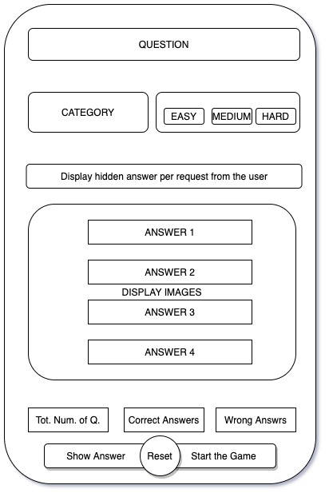

# Trivia Game Using an API
This game was developed using vanilla JS, html and CSS.

## Technologies
Three front end web development languages were utilized in this project: Vanilla JS, CSS and HTML.

### About the project
As stated above, this game uses an API which generates questions and answers. It is designed for people who want to challenge themselves by answering random questions so they can cultivate themselves intellectually. The game randomly asks the player a question, and each question has its answers. The player has to click on the correct answer. If the player clicks on the correct answer, the button's background color change to green. Otherwise, it changes to red.
Next, another question is presented to the user. and repeat the steps from above until the 10 questions are answered before the game stops. There game pays audio sounds for both correct answer and wrong answers. If the player answer 7 questions and more correctly, the screen displays a victory image. Else, it displays the failure message. To continue with the game, the player must click on the "reset" button wich bring the "home" screen back.

### Wire Frame

### Live Link
[Trivia Game](https://shindanosingi.github.io/Project1_Trivia_Game/)

#### For more projects, click on the link below
[More Projects](https://github.com/ShindanoSingi)